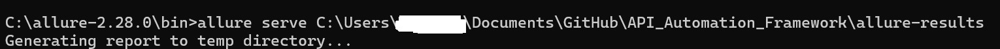
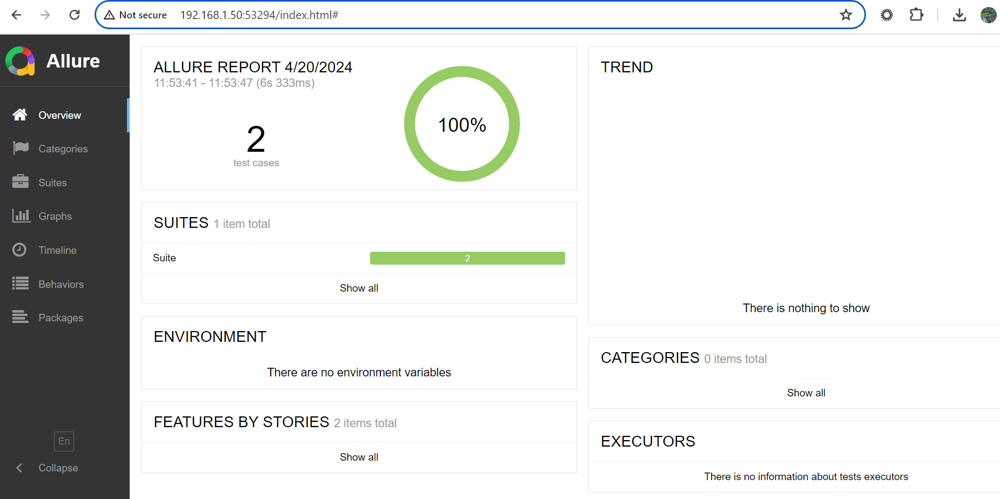
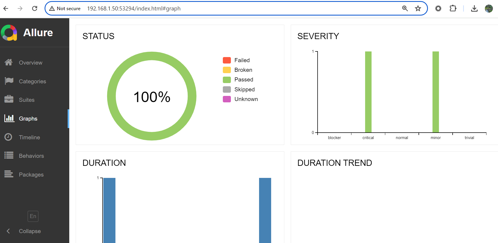
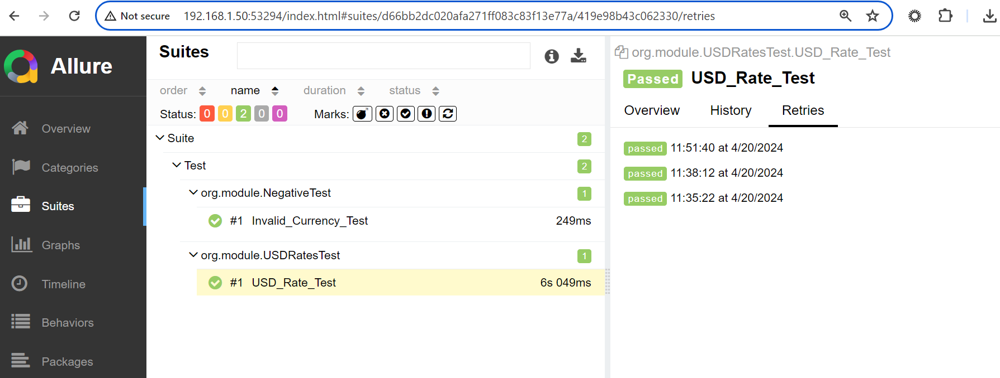

**REST API Test Automation Framework** : 
This Test Automation Framework is created using Java + TestNG + RestAssured + Allure which can be used across different api based applications. In this approach, 
the endeavor is to wrap the common requirements of API's for specific application within the wrapper class in order to test the API's without spending 
any extra efforts on common requirements. With this framework in place, whenever we need to automate API's, we would not need to start from scratch, 
and begin with developing the test cases straight away.
Allure is used for reporting.

**Pre-Requisites**
 1) IntelliJ or Eclipse
 2) Java JDK-1.8 or higher
 3) Apache Maven 3 or higher
 4) Allure 2.27.0 or higher 

**Steps to Run :**
1) Clone this repo into your local. command to use  
**git clone https://github.com/jayveerss/API_Automation_Framework.git**
2) You can open and run this project in IDE or 
3) Go to the same location where this repo cloned and launch command terminal and run **mvn clean install** command
4) Download allure binaries from https://github.com/allure-framework/allure2/releases/tag/2.28.0
and extract it to any location on your system.
5) You can set allure path into system variables or go to \bin where allure binaries extracted and launch command terminal.
6) Run this command to see latest run report on allure portal
   **allure serve \<path of allure results>**

i.e. **allure serve C:\Learning\APIAutomation_SDET_R3\APIAutomatio\allure-results**
please refer below screenshot for reference.

